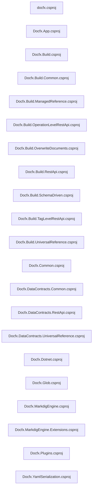
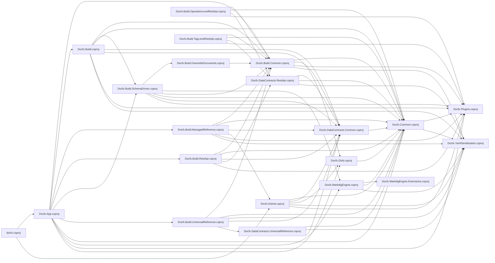
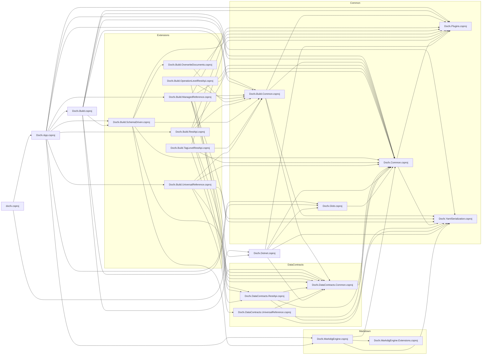
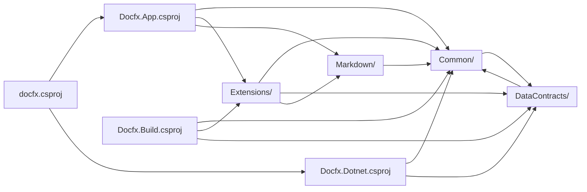
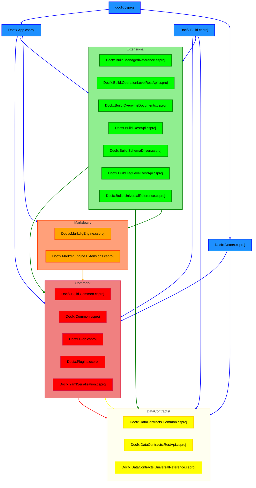

```mermaid
graph LR
  %% Projects
  docfx.csproj
  Docfx.App.csproj
  Docfx.Dotnet.csproj
  Docfx.Build.csproj
  Docfx.Build.Common.csproj
  Docfx.Build.ManagedReference.csproj
  Docfx.Build.OperationLevelRestApi.csproj
  Docfx.Build.OverwriteDocuments.csproj
  Docfx.Build.RestApi.csproj
  Docfx.Build.SchemaDriven.csproj
  Docfx.Build.TagLevelRestApi.csproj
  Docfx.Build.UniversalReference.csproj
  Docfx.Common.csproj
  Docfx.DataContracts.Common.csproj
  Docfx.DataContracts.RestApi.csproj
  Docfx.DataContracts.UniversalReference.csproj
  Docfx.Glob.csproj
  Docfx.MarkdigEngine.csproj
  Docfx.MarkdigEngine.Extensions.csproj
  Docfx.Plugins.csproj
  Docfx.YamlSerialization.csproj

  %% Dependencies
  docfx.csproj --> Docfx.App.csproj
  docfx.csproj --> Docfx.Dotnet.csproj
  Docfx.App.csproj --> Docfx.Build.Common.csproj
  Docfx.App.csproj --> Docfx.Build.csproj
  Docfx.App.csproj --> Docfx.Build.ManagedReference.csproj
  Docfx.App.csproj --> Docfx.Build.RestApi.csproj
  Docfx.App.csproj --> Docfx.Build.SchemaDriven.csproj
  Docfx.App.csproj --> Docfx.Build.UniversalReference.csproj
  Docfx.App.csproj --> Docfx.Common.csproj
  Docfx.App.csproj --> Docfx.MarkdigEngine.csproj
  Docfx.App.csproj --> Docfx.Plugins.csproj
  Docfx.App.csproj --> Docfx.Glob.csproj
  Docfx.Build.csproj --> Docfx.Build.Common.csproj
  Docfx.Build.csproj --> Docfx.Build.SchemaDriven.csproj
  Docfx.Build.csproj --> Docfx.Common.csproj
  Docfx.Build.csproj --> Docfx.DataContracts.Common.csproj
  Docfx.Build.csproj --> Docfx.Glob.csproj
  Docfx.Build.csproj --> Docfx.Plugins.csproj
  Docfx.Build.csproj --> Docfx.YamlSerialization.csproj
  Docfx.Build.Common.csproj --> Docfx.Common.csproj
  Docfx.Build.Common.csproj --> Docfx.DataContracts.Common.csproj
  Docfx.Build.Common.csproj --> Docfx.Plugins.csproj
  Docfx.Build.Common.csproj --> Docfx.YamlSerialization.csproj
  Docfx.Build.ManagedReference.csproj --> Docfx.Build.Common.csproj
  Docfx.Build.ManagedReference.csproj --> Docfx.Common.csproj
  Docfx.Build.ManagedReference.csproj --> Docfx.DataContracts.Common.csproj
  Docfx.Build.ManagedReference.csproj --> Docfx.Dotnet.csproj
  Docfx.Build.ManagedReference.csproj --> Docfx.Plugins.csproj
  Docfx.Build.ManagedReference.csproj --> Docfx.YamlSerialization.csproj
  Docfx.Build.OperationLevelRestApi.csproj --> Docfx.Build.Common.csproj
  Docfx.Build.OperationLevelRestApi.csproj --> Docfx.Common.csproj
  Docfx.Build.OperationLevelRestApi.csproj --> Docfx.DataContracts.RestApi.csproj
  Docfx.Build.OperationLevelRestApi.csproj --> Docfx.Plugins.csproj
  Docfx.Build.OverwriteDocuments.csproj --> Docfx.Build.Common.csproj
  Docfx.Build.RestApi.csproj --> Docfx.Build.Common.csproj
  Docfx.Build.RestApi.csproj --> Docfx.Common.csproj
  Docfx.Build.RestApi.csproj --> Docfx.DataContracts.Common.csproj
  Docfx.Build.RestApi.csproj --> Docfx.DataContracts.RestApi.csproj
  Docfx.Build.RestApi.csproj --> Docfx.Plugins.csproj
  Docfx.Build.SchemaDriven.csproj --> Docfx.Build.OverwriteDocuments.csproj
  Docfx.Build.SchemaDriven.csproj --> Docfx.MarkdigEngine.csproj
  Docfx.Build.SchemaDriven.csproj --> Docfx.Build.Common.csproj
  Docfx.Build.SchemaDriven.csproj --> Docfx.Common.csproj
  Docfx.Build.SchemaDriven.csproj --> Docfx.DataContracts.Common.csproj
  Docfx.Build.SchemaDriven.csproj --> Docfx.Plugins.csproj
  Docfx.Build.TagLevelRestApi.csproj --> Docfx.Build.Common.csproj
  Docfx.Build.TagLevelRestApi.csproj --> Docfx.Common.csproj
  Docfx.Build.TagLevelRestApi.csproj --> Docfx.DataContracts.RestApi.csproj
  Docfx.Build.TagLevelRestApi.csproj --> Docfx.Plugins.csproj
  Docfx.Build.UniversalReference.csproj --> Docfx.Build.Common.csproj
  Docfx.Build.UniversalReference.csproj --> Docfx.Common.csproj
  Docfx.Build.UniversalReference.csproj --> Docfx.YamlSerialization.csproj
  Docfx.Build.UniversalReference.csproj --> Docfx.DataContracts.Common.csproj
  Docfx.Build.UniversalReference.csproj --> Docfx.DataContracts.UniversalReference.csproj
  Docfx.Common.csproj --> Docfx.Plugins.csproj
  Docfx.Common.csproj --> Docfx.YamlSerialization.csproj
  Docfx.DataContracts.Common.csproj --> Docfx.Common.csproj
  Docfx.DataContracts.RestApi.csproj --> Docfx.DataContracts.Common.csproj
  Docfx.DataContracts.RestApi.csproj --> Docfx.Common.csproj
  Docfx.DataContracts.RestApi.csproj --> Docfx.YamlSerialization.csproj
  Docfx.DataContracts.UniversalReference.csproj --> Docfx.Common.csproj
  Docfx.DataContracts.UniversalReference.csproj --> Docfx.YamlSerialization.csproj
  Docfx.DataContracts.UniversalReference.csproj --> Docfx.DataContracts.Common.csproj
  Docfx.Dotnet.csproj --> Docfx.Common.csproj
  Docfx.Dotnet.csproj --> Docfx.DataContracts.Common.csproj
  Docfx.Dotnet.csproj --> Docfx.Glob.csproj
  Docfx.Dotnet.csproj --> Docfx.YamlSerialization.csproj
  Docfx.Dotnet.csproj --> Docfx.Plugins.csproj
  Docfx.Glob.csproj --> Docfx.Common.csproj
  Docfx.MarkdigEngine.csproj --> Docfx.MarkdigEngine.Extensions.csproj
  Docfx.MarkdigEngine.csproj --> Docfx.Common.csproj
  Docfx.MarkdigEngine.csproj --> Docfx.YamlSerialization.csproj

  %% Styling for nodes
  style docfx.csproj fill:#FF6347,stroke:#8B0000,stroke-width:2px,color:black;
  style Docfx.App.csproj fill:#87CEEB,stroke:#00008B,stroke-width:2px,color:black;
  style Docfx.Build.csproj fill:#FFFFE0,stroke:#BDB76B,stroke-width:2px,color:black;
  style Docfx.Build.Common.csproj fill:#98FB98,stroke:#006400,stroke-width:2px,color:black;
  style Docfx.Build.ManagedReference.csproj fill:#FFA07A,stroke:#FF8C00,stroke-width:2px,color:black;
  style Docfx.Build.OperationLevelRestApi.csproj fill:#D8BFD8,stroke:#4B0082,stroke-width:2px,color:black;
  style Docfx.Build.OverwriteDocuments.csproj fill:#FFDAB9,stroke:#FF8C00,stroke-width:2px,color:black;
  style Docfx.Build.RestApi.csproj fill:#FF4500,stroke:#8B0000,stroke-width:2px,color:black;
  style Docfx.Build.SchemaDriven.csproj fill:#DA70D6,stroke:#800080,stroke-width:2px,color:black;
  style Docfx.Build.TagLevelRestApi.csproj fill:#9370DB,stroke:#4B0082,stroke-width:2px,color:black;
  style Docfx.Build.UniversalReference.csproj fill:#40E0D0,stroke:#008080,stroke-width:2px,color:black;
  style Docfx.Common.csproj fill:#ADFF2F,stroke:#556B2F,stroke-width:2px,color:black;
  style Docfx.DataContracts.Common.csproj fill:#FF6347,stroke:#8B0000,stroke-width:2px,color:black;
  style Docfx.DataContracts.RestApi.csproj fill:#87CEEB,stroke:#00008B,stroke-width:2px,color:black;
  style Docfx.DataContracts.UniversalReference.csproj fill:#FFFFE0,stroke:#BDB76B,stroke-width:2px,color:black;
  style Docfx.Dotnet.csproj fill:#98FB98,stroke:#006400,stroke-width:2px,color:black;
  style Docfx.Glob.csproj fill:#FFA07A,stroke:#FF8C00,stroke-width:2px,color:black;
  style Docfx.MarkdigEngine.csproj fill:#D8BFD8,stroke:#4B0082,stroke-width:2px,color:black;
  style Docfx.MarkdigEngine.Extensions.csproj fill:#FFDAB9,stroke:#FF8C00,stroke-width:2px,color:black;
  style Docfx.Plugins.csproj fill:#FF4500,stroke:#8B0000,stroke-width:2px,color:black;
  style Docfx.YamlSerialization.csproj fill:#DA70D6,stroke:#800080,stroke-width:2px,color:black;

  %% Styling for arrows (The arrows stroke color is the same as the nodes fill color)
  
  %% docfx.csproj
  linkStyle 0 stroke:#FF6347,stroke-width:2px;
  linkStyle 1 stroke:#FF6347,stroke-width:2px;

  %% Docfx.App.csproj
  linkStyle 2 stroke:#87CEEB,stroke-width:2px;
  linkStyle 3 stroke:#87CEEB,stroke-width:2px;
  linkStyle 4 stroke:#87CEEB,stroke-width:2px;
  linkStyle 5 stroke:#87CEEB,stroke-width:2px;
  linkStyle 6 stroke:#87CEEB,stroke-width:2px;  
  linkStyle 7 stroke:#87CEEB,stroke-width:2px;
  linkStyle 8 stroke:#87CEEB,stroke-width:2px;
  linkStyle 9 stroke:#87CEEB,stroke-width:2px;
  linkStyle 10 stroke:#87CEEB,stroke-width:2px;
  linkStyle 11 stroke:#87CEEB,stroke-width:2px;

  %% Docfx.Build.csproj
  linkStyle 12 stroke:#FFFFE0,stroke-width:2px;
  linkStyle 13 stroke:#FFFFE0,stroke-width:2px;
  linkStyle 14 stroke:#FFFFE0,stroke-width:2px;
  linkStyle 15 stroke:#FFFFE0,stroke-width:2px;
  linkStyle 16 stroke:#FFFFE0,stroke-width:2px;
  linkStyle 17 stroke:#FFFFE0,stroke-width:2px;
  linkStyle 18 stroke:#FFFFE0,stroke-width:2px;

  %% Docfx.Build.Common.csproj
  linkStyle 19 stroke:#98FB98,stroke-width:2px;
  linkStyle 20 stroke:#98FB98,stroke-width:2px;
  linkStyle 21 stroke:#98FB98,stroke-width:2px;
  linkStyle 22 stroke:#98FB98,stroke-width:2px;

  %% Docfx.Build.ManagedReference.csproj
  linkStyle 23 stroke:#FFA07A,stroke-width:2px;
  linkStyle 24 stroke:#FFA07A,stroke-width:2px;
  linkStyle 25 stroke:#FFA07A,stroke-width:2px;
  linkStyle 26 stroke:#FFA07A,stroke-width:2px;
  linkStyle 27 stroke:#FFA07A,stroke-width:2px;
  linkStyle 28 stroke:#FFA07A,stroke-width:2px;

  %% Docfx.Build.OperationLevelRestApi.csproj
  linkStyle 29 stroke:#D8BFD8,stroke-width:2px;
  linkStyle 30 stroke:#D8BFD8,stroke-width:2px;
  linkStyle 31 stroke:#D8BFD8,stroke-width:2px;
  linkStyle 32 stroke:#D8BFD8,stroke-width:2px;

  %% Docfx.Build.OverwriteDocuments.csproj
  linkStyle 33 stroke:#FFDAB9,stroke-width:2px;

  %% Docfx.Build.RestApi.csproj
  linkStyle 34 stroke:#FF4500,stroke-width:2px;
  linkStyle 35 stroke:#FF4500,stroke-width:2px;
  linkStyle 36 stroke:#FF4500,stroke-width:2px;
  linkStyle 37 stroke:#FF4500,stroke-width:2px;
  linkStyle 38 stroke:#FF4500,stroke-width:2px;

  %% Docfx.Build.SchemaDriven.csproj
  linkStyle 39 stroke:#DA70D6,stroke-width:2px;
  linkStyle 40 stroke:#DA70D6,stroke-width:2px;
  linkStyle 41 stroke:#DA70D6,stroke-width:2px;
  linkStyle 42 stroke:#DA70D6,stroke-width:2px;
  linkStyle 43 stroke:#DA70D6,stroke-width:2px;
  linkStyle 44 stroke:#DA70D6,stroke-width:2px;

  %% Docfx.Build.TagLevelRestApi.csproj
  linkStyle 45 stroke:#9370DB,stroke-width:2px;
  linkStyle 46 stroke:#9370DB,stroke-width:2px;
  linkStyle 47 stroke:#9370DB,stroke-width:2px;
  linkStyle 48 stroke:#9370DB,stroke-width:2px;

  %% Docfx.Build.UniversalReference.csproj
  linkStyle 49 stroke:#40E0D0,stroke-width:2px;
  linkStyle 50 stroke:#40E0D0,stroke-width:2px;
  linkStyle 51 stroke:#40E0D0,stroke-width:2px;
  linkStyle 52 stroke:#40E0D0,stroke-width:2px;
  linkStyle 53 stroke:#40E0D0,stroke-width:2px;

  %% Docfx.Common.csproj
  linkStyle 54 stroke:#ADFF2F,stroke-width:2px;
  linkStyle 55 stroke:#ADFF2F,stroke-width:2px;

  %% Docfx.DataContracts.Common.csproj
  linkStyle 56 stroke:#FF6347,stroke-width:2px;

  %% Docfx.DataContracts.RestApi.csproj
  linkStyle 57 stroke:#87CEEB,stroke-width:2px;
  linkStyle 58 stroke:#87CEEB,stroke-width:2px;
  linkStyle 59 stroke:#87CEEB,stroke-width:2px;

  %% Docfx.DataContracts.UniversalReference.csproj
  linkStyle 60 stroke:#FFFFE0,stroke-width:2px;
  linkStyle 61 stroke:#FFFFE0,stroke-width:2px;
  linkStyle 62 stroke:#FFFFE0,stroke-width:2px;

  %% Docfx.Dotnet.csproj
  linkStyle 63 stroke:#98FB98,stroke-width:2px;
  linkStyle 64 stroke:#98FB98,stroke-width:2px;
  linkStyle 65 stroke:#98FB98,stroke-width:2px;
  linkStyle 66 stroke:#98FB98,stroke-width:2px;
  linkStyle 67 stroke:#98FB98,stroke-width:2px;

  %% Docfx.Glob.csproj
  linkStyle 68 stroke:#FFA07A,stroke-width:2px;

  %% Docfx.MarkdigEngine.csproj
  linkStyle 69 stroke:#D8BFD8,stroke-width:2px;
  linkStyle 70 stroke:#D8BFD8,stroke-width:2px;
  linkStyle 71 stroke:#D8BFD8,stroke-width:2px;
```

```mermaid
graph LR

  %% PROJECTS

  %% High-Level Projects
  docfx.csproj
  Docfx.App.csproj
  Docfx.Build.csproj
  Docfx.Dotnet.csproj

  %% Apply styles
  style docfx.csproj fill:DodgerBlue,stroke:Blue,stroke-width:2px,color:black;
  style Docfx.App.csproj fill:DodgerBlue,stroke:Blue,stroke-width:2px,color:black;
  style Docfx.Build.csproj fill:DodgerBlue,stroke:Blue,stroke-width:2px,color:black;
  style Docfx.Dotnet.csproj fill:DodgerBlue,stroke:Blue,stroke-width:2px,color:black;

  %% Common Folder: red
  subgraph Common ["Common"]
    Docfx.Build.Common.csproj
    Docfx.Common.csproj
    Docfx.Glob.csproj
    Docfx.Plugins.csproj
    Docfx.YamlSerialization.csproj
  end
  style Common fill:LightCoral,stroke:Crimson,stroke-width:2px

  %% Individual node styles (red border for each project)
  style Docfx.Build.Common.csproj fill:Red,stroke:Crimson,stroke-width:2px,color:black;
  style Docfx.Common.csproj fill:Red,stroke:Crimson,stroke-width:2px,color:black;
  style Docfx.Glob.csproj fill:Red,stroke:Crimson,stroke-width:2px,color:black;
  style Docfx.Plugins.csproj fill:Red,stroke:Crimson,stroke-width:2px,color:black;
  style Docfx.YamlSerialization.csproj fill:Red,stroke:Crimson,stroke-width:2px,color:black;
  
  %% DataContracts Folder: yellow
  subgraph DataContracts ["DataContracts"]
    Docfx.DataContracts.Common.csproj
    Docfx.DataContracts.RestApi.csproj
    Docfx.DataContracts.UniversalReference.csproj
  end
  style DataContracts fill:Ivory,stroke:Gold,stroke-width:2px

  %% Individual node styles (yellow border for each project)
  style Docfx.DataContracts.Common.csproj fill:Yellow,stroke:Gold,stroke-width:2px,color:black;
  style Docfx.DataContracts.RestApi.csproj fill:Yellow,stroke:Gold,stroke-width:2px,color:black;
  style Docfx.DataContracts.UniversalReference.csproj fill:Yellow,stroke:Yellow,stroke-width:2px,color:black;
  
  %% Extensions Folder: green
  subgraph Extensions ["Extensions"]
    Docfx.Build.ManagedReference.csproj
    Docfx.Build.OperationLevelRestApi.csproj
    Docfx.Build.OverwriteDocuments.csproj
    Docfx.Build.RestApi.csproj
    Docfx.Build.SchemaDriven.csproj
    Docfx.Build.TagLevelRestApi.csproj
    Docfx.Build.UniversalReference.csproj
  end
  style Extensions fill:LightGreen,stroke:Green,stroke-width:2px

  %% Individual node styles (green border for each project)
  style Docfx.Build.ManagedReference.csproj fill:Lime,stroke:Green,stroke-width:2px,color:black;
  style Docfx.Build.OperationLevelRestApi.csproj fill:Lime,stroke:Green,stroke-width:2px,color:black;
  style Docfx.Build.OverwriteDocuments.csproj fill:Lime,stroke:Green,stroke-width:2px,color:black;
  style Docfx.Build.RestApi.csproj fill:Lime,stroke:Green,stroke-width:2px,color:black;
  style Docfx.Build.SchemaDriven.csproj fill:Lime,stroke:Green,stroke-width:2px,color:black;
  style Docfx.Build.TagLevelRestApi.csproj fill:Lime,stroke:Green,stroke-width:2px,color:black;
  style Docfx.Build.UniversalReference.csproj fill:Lime,stroke:Green,stroke-width:2px,color:black;
  
  %% Markdown Folder: orange
  subgraph Markdown ["Markdown"]
    Docfx.MarkdigEngine.csproj
    Docfx.MarkdigEngine.Extensions.csproj
  end
  style Markdown fill:LightSalmon,stroke:OrangeRed,stroke-width:2px;

  %% Individual node styles (orange border for each project)
  style Docfx.MarkdigEngine.csproj fill:Orange,stroke:OrangeRed,stroke-width:2px,color:black;
  style Docfx.MarkdigEngine.Extensions.csproj fill:Orange,stroke:OrangeRed,stroke-width:2px,color:black;

  %% DEPENDENCIES
  
  %% High-Level: blue arrows
  docfx.csproj --> Docfx.App.csproj
  docfx.csproj --> Docfx.Dotnet.csproj
  Docfx.App.csproj --> Docfx.Build.Common.csproj
  Docfx.App.csproj --> Docfx.Build.csproj
  Docfx.App.csproj --> Docfx.Build.ManagedReference.csproj
  Docfx.App.csproj --> Docfx.Build.RestApi.csproj
  Docfx.App.csproj --> Docfx.Build.SchemaDriven.csproj
  Docfx.App.csproj --> Docfx.Build.UniversalReference.csproj
  Docfx.App.csproj --> Docfx.Common.csproj
  Docfx.App.csproj --> Docfx.MarkdigEngine.csproj
  Docfx.App.csproj --> Docfx.Plugins.csproj
  Docfx.App.csproj --> Docfx.Glob.csproj
  Docfx.Build.csproj --> Docfx.Build.Common.csproj
  Docfx.Build.csproj --> Docfx.Build.SchemaDriven.csproj
  Docfx.Build.csproj --> Docfx.Common.csproj
  Docfx.Build.csproj --> Docfx.DataContracts.Common.csproj
  Docfx.Build.csproj --> Docfx.Glob.csproj
  Docfx.Build.csproj --> Docfx.Plugins.csproj
  Docfx.Build.csproj --> Docfx.YamlSerialization.csproj
  Docfx.Dotnet.csproj --> Docfx.Common.csproj
  Docfx.Dotnet.csproj --> Docfx.DataContracts.Common.csproj
  Docfx.Dotnet.csproj --> Docfx.Glob.csproj
  Docfx.Dotnet.csproj --> Docfx.YamlSerialization.csproj
  Docfx.Dotnet.csproj --> Docfx.Plugins.csproj

  %% Common: red arrows
  Docfx.Build.Common.csproj --> Docfx.Common.csproj
  Docfx.Build.Common.csproj --> Docfx.DataContracts.Common.csproj
  Docfx.Build.Common.csproj --> Docfx.Plugins.csproj
  Docfx.Build.Common.csproj --> Docfx.YamlSerialization.csproj
  Docfx.Common.csproj --> Docfx.Plugins.csproj
  Docfx.Common.csproj --> Docfx.YamlSerialization.csproj
  Docfx.Glob.csproj --> Docfx.Common.csproj

  %% DataContracts: yellow arrows
  Docfx.DataContracts.Common.csproj --> Docfx.Common.csproj
  Docfx.DataContracts.RestApi.csproj --> Docfx.DataContracts.Common.csproj
  Docfx.DataContracts.RestApi.csproj --> Docfx.Common.csproj
  Docfx.DataContracts.RestApi.csproj --> Docfx.YamlSerialization.csproj
  Docfx.DataContracts.UniversalReference.csproj --> Docfx.Common.csproj
  Docfx.DataContracts.UniversalReference.csproj --> Docfx.YamlSerialization.csproj
  Docfx.DataContracts.UniversalReference.csproj --> Docfx.DataContracts.Common.csproj 

  %% Extensions: green arrows
  Docfx.Build.ManagedReference.csproj --> Docfx.Build.Common.csproj
  Docfx.Build.ManagedReference.csproj --> Docfx.Common.csproj
  Docfx.Build.ManagedReference.csproj --> Docfx.DataContracts.Common.csproj
  Docfx.Build.ManagedReference.csproj --> Docfx.Dotnet.csproj
  Docfx.Build.ManagedReference.csproj --> Docfx.Plugins.csproj
  Docfx.Build.ManagedReference.csproj --> Docfx.YamlSerialization.csproj  
  Docfx.Build.OperationLevelRestApi.csproj --> Docfx.Build.Common.csproj
  Docfx.Build.OperationLevelRestApi.csproj --> Docfx.Common.csproj
  Docfx.Build.OperationLevelRestApi.csproj --> Docfx.DataContracts.RestApi.csproj
  Docfx.Build.OperationLevelRestApi.csproj --> Docfx.Plugins.csproj
  Docfx.Build.OverwriteDocuments.csproj --> Docfx.Build.Common.csproj
  Docfx.Build.RestApi.csproj --> Docfx.Build.Common.csproj
  Docfx.Build.RestApi.csproj --> Docfx.Common.csproj
  Docfx.Build.RestApi.csproj --> Docfx.DataContracts.Common.csproj
  Docfx.Build.RestApi.csproj --> Docfx.DataContracts.RestApi.csproj
  Docfx.Build.RestApi.csproj --> Docfx.Plugins.csproj  
  Docfx.Build.SchemaDriven.csproj --> Docfx.Build.OverwriteDocuments.csproj
  Docfx.Build.SchemaDriven.csproj --> Docfx.MarkdigEngine.csproj
  Docfx.Build.SchemaDriven.csproj --> Docfx.Build.Common.csproj
  Docfx.Build.SchemaDriven.csproj --> Docfx.Common.csproj
  Docfx.Build.SchemaDriven.csproj --> Docfx.DataContracts.Common.csproj
  Docfx.Build.SchemaDriven.csproj --> Docfx.Plugins.csproj  
  Docfx.Build.TagLevelRestApi.csproj --> Docfx.Build.Common.csproj
  Docfx.Build.TagLevelRestApi.csproj --> Docfx.Common.csproj
  Docfx.Build.TagLevelRestApi.csproj --> Docfx.DataContracts.RestApi.csproj
  Docfx.Build.TagLevelRestApi.csproj --> Docfx.Plugins.csproj  
  Docfx.Build.UniversalReference.csproj --> Docfx.Build.Common.csproj
  Docfx.Build.UniversalReference.csproj --> Docfx.Common.csproj
  Docfx.Build.UniversalReference.csproj --> Docfx.YamlSerialization.csproj
  Docfx.Build.UniversalReference.csproj --> Docfx.DataContracts.Common.csproj
  Docfx.Build.UniversalReference.csproj --> Docfx.DataContracts.UniversalReference.csproj

  %% Markdown: orange arrows
  Docfx.MarkdigEngine.csproj --> Docfx.MarkdigEngine.Extensions.csproj
  Docfx.MarkdigEngine.csproj --> Docfx.Common.csproj
  Docfx.MarkdigEngine.csproj --> Docfx.YamlSerialization.csproj

  %% Styling arrows
  
  %% High-Level: blue
  linkStyle 0 stroke:blue, stroke-width:2px;
  linkStyle 1 stroke:blue, stroke-width:2px;
  linkStyle 2 stroke:blue, stroke-width:2px;
  linkStyle 3 stroke:blue, stroke-width:2px;
  linkStyle 4 stroke:blue, stroke-width:2px;
  linkStyle 5 stroke:blue, stroke-width:2px;
  linkStyle 6 stroke:blue, stroke-width:2px;
  linkStyle 7 stroke:blue, stroke-width:2px;
  linkStyle 8 stroke:blue, stroke-width:2px;
  linkStyle 9 stroke:blue, stroke-width:2px;
  linkStyle 10 stroke:blue, stroke-width:2px;
  linkStyle 11 stroke:blue, stroke-width:2px;
  linkStyle 12 stroke:blue, stroke-width:2px;
  linkStyle 13 stroke:blue, stroke-width:2px;
  linkStyle 14 stroke:blue, stroke-width:2px;
  linkStyle 15 stroke:blue, stroke-width:2px;
  linkStyle 16 stroke:blue, stroke-width:2px;
  linkStyle 17 stroke:blue, stroke-width:2px;
  linkStyle 18 stroke:blue, stroke-width:2px;
  linkStyle 19 stroke:blue, stroke-width:2px;
  linkStyle 20 stroke:blue, stroke-width:2px;
  linkStyle 21 stroke:blue, stroke-width:2px;
  linkStyle 22 stroke:blue, stroke-width:2px;
  linkStyle 23 stroke:blue, stroke-width:2px;

  %% Common: red
  linkStyle 24 stroke:red, stroke-width:2px;
  linkStyle 25 stroke:red, stroke-width:2px;
  linkStyle 26 stroke:red, stroke-width:2px;
  linkStyle 27 stroke:red, stroke-width:2px;
  linkStyle 28 stroke:red, stroke-width:2px;
  linkStyle 29 stroke:red, stroke-width:2px;
  linkStyle 30 stroke:red, stroke-width:2px;

  %% DataContracts: yellow
  linkStyle 31 stroke:yellow, stroke-width:2px;
  linkStyle 32 stroke:yellow, stroke-width:2px;
  linkStyle 33 stroke:yellow, stroke-width:2px;
  linkStyle 34 stroke:yellow, stroke-width:2px;
  linkStyle 35 stroke:yellow, stroke-width:2px;
  linkStyle 36 stroke:yellow, stroke-width:2px;
  linkStyle 37 stroke:yellow, stroke-width:2px;

  %% Extensions: green
  linkStyle 38 stroke:green, stroke-width:2px;
  linkStyle 39 stroke:green, stroke-width:2px;
  linkStyle 40 stroke:green, stroke-width:2px;
  linkStyle 41 stroke:green, stroke-width:2px;
  linkStyle 42 stroke:green, stroke-width:2px;
  linkStyle 43 stroke:green, stroke-width:2px;
  linkStyle 44 stroke:green, stroke-width:2px;
  linkStyle 45 stroke:green, stroke-width:2px;
  linkStyle 46 stroke:green, stroke-width:2px;
  linkStyle 47 stroke:green, stroke-width:2px;
  linkStyle 48 stroke:green, stroke-width:2px;
  linkStyle 49 stroke:green, stroke-width:2px;
  linkStyle 50 stroke:green, stroke-width:2px;
  linkStyle 51 stroke:green, stroke-width:2px;
  linkStyle 52 stroke:green, stroke-width:2px;
  linkStyle 53 stroke:green, stroke-width:2px;
  linkStyle 54 stroke:green, stroke-width:2px;
  linkStyle 55 stroke:green, stroke-width:2px;
  linkStyle 56 stroke:green, stroke-width:2px;
  linkStyle 57 stroke:green, stroke-width:2px;
  linkStyle 58 stroke:green, stroke-width:2px;
  linkStyle 59 stroke:green, stroke-width:2px;
  linkStyle 60 stroke:green, stroke-width:2px;
  linkStyle 61 stroke:green, stroke-width:2px;
  linkStyle 62 stroke:green, stroke-width:2px;
  linkStyle 63 stroke:green, stroke-width:2px;
  linkStyle 64 stroke:green, stroke-width:2px;
  linkStyle 65 stroke:green, stroke-width:2px;
  linkStyle 66 stroke:green, stroke-width:2px;
  linkStyle 67 stroke:green, stroke-width:2px;
  linkStyle 68 stroke:green, stroke-width:2px;

  %% Markdown: orange
  linkStyle 69 stroke:orange, stroke-width:2px;
  linkStyle 70 stroke:orange, stroke-width:2px;
  linkStyle 71 stroke:orange, stroke-width:2px;
```

# Project Dependencies

## Script

### File Arrangement Script

The script I use writes the **physical file arrangement** to a Markdown file. It captures the folder and file structure as it exists on disk.

```csharp
#r "nuget: System.IO.Abstractions"

using System;
using System.IO;
using System.Linq;

var rootPath = @".";
var outputPath = @"filetree.md";

// Read extensions to exclude from arguments, handling wildcard ".*"
var excludedExtensions = Args.Select(arg => arg == ".*" ? string.Empty : arg).ToList();

using (var writer = new StreamWriter(outputPath))
{
    writer.WriteLine("# Solution Structure");
    writer.WriteLine("");
    TraverseDirectory(rootPath, writer, "");
}

Console.WriteLine("Markdown file generated!");

void TraverseDirectory(string path, StreamWriter writer, string indent)
{
    foreach (var directory in Directory.GetDirectories(path))
    {
        var dirName = Path.GetFileName(directory);
        // exclude bin and obj directories

        if (dirName == "bin" || dirName == "obj") continue;

        writer.WriteLine($"{indent}- {dirName}");
        TraverseDirectory(directory, writer, indent + "  ");
    }

    foreach (var file in Directory.GetFiles(path))
    {
        var fileExtension = Path.GetExtension(file);
        // Skip files if extensions match the excluded list
        if (excludedExtensions.Contains(string.Empty) || excludedExtensions.Any(ext => fileExtension.Equals(ext, StringComparison.OrdinalIgnoreCase)))
            continue;

        writer.WriteLine($"{indent}- {Path.GetFileName(file)}");
    }
}
```

### Script Functionality  

- Writes all folders and files from its execution root to a Markdown file named `filetree.md`, placing it at the same root level.
- Excluding `bin` and `obj` directories.
- Writes a header `# Solution Structure`.
- Creates a list with sublists of the directories including the files of the root path.
- Takes one argument that specify what file type to exclude.

### Example Commands

Excluding `bin` and `obj` directories: `dotnet script MarkdownSolutionTreeGenerator.csx`

Excluding `bin` and `obj` directories and all `.cs` files: `dotnet script MarkdownSolutionTreeGenerator.csx -- ".cs"`

Excluding `bin` and `obj` directories and all files: `dotnet script MarkdownSolutionTreeGenerator.csx -- ".*"`

### Markdown Output

**excluding all files**  

```markdown
# Solution Structure

- .vscode
- docfx
  - Extensions
  - Models
  - Properties
- Docfx.App
  - Build
  - Config
  - Helpers
- Docfx.Build
  - ApiPage
  - Conceptual
  - PostProcessors
  - ResourceFileReaders
  - ResourceFiles
  - Settings
  - TableOfContents
  - TemplateProcessors
    - Preprocessors
    - ViewRenderers
  - XRefMaps
- Docfx.Build.Common
  - ModelAttributeHandlers
    - Handlers
  - Reference
- Docfx.Build.ManagedReference
  - BuildOutputs
- Docfx.Build.OperationLevelRestApi
- Docfx.Build.OverwriteDocuments
  - ExtendedModels
  - Models
  - Rules
- Docfx.Build.RestApi
  - Swagger
    - Internals
      - JsonLocation
- Docfx.Build.SchemaDriven
  - Exceptions
  - Models
  - Processors
  - Validators
- Docfx.Build.TagLevelRestApi
- Docfx.Build.UniversalReference
  - BuildOutputs
- Docfx.Common
  - EntityMergers
  - Exceptions
  - FileAbstractLayer
  - Git
  - Json
    - NewtonsoftJson
    - System.Text.Json
  - Loggers
  - Path
  - ResourcePools
- Docfx.DataContracts.Common
  - Attributes
  - ExternalReferences
- Docfx.DataContracts.RestApi
- Docfx.DataContracts.UniversalReference
- Docfx.Dotnet
  - ExtensionMethods
  - Filters
  - ManagedReference
    - Models
    - Resolvers
    - Visitors
  - Parsers
  - Resources
  - SourceLink
- Docfx.Glob
- Docfx.MarkdigEngine
  - YamlHeader
- Docfx.MarkdigEngine.Extensions
  - Aggregator
  - CodeSnippet
  - HeadingId
  - Inclusion
    - InclusionBlock
    - InclusionInline
  - InlineOnly
  - Interactive
  - LineNumber
  - MonikerRange
  - NestedColumn
  - Noloc
  - PlantUml
  - QuoteSectionNote
  - ResolveLink
  - Rewriter
  - Row
  - TabGroup
  - TripleColon
  - Xref
- Docfx.Plugins
- Docfx.YamlSerialization
  - Helpers
  - NodeDeserializers
  - NodeTypeResolvers
  - ObjectDescriptors
  - ObjectFactories
  - ObjectGraphTraversalStrategies
  - ObjectGraphVisitors
  - TypeInspectors
```

### Notes

**Script**:

- Adapt the script to extract the **logical file arrangement**, reflecting how files are organized in Visual Studio's Solution Explorer. Look in to Roslyn.
- `rootPath` as an argument so I can use it in selected directories.

## Extract Projects

Now that I have mapped the **physical file arrangement** solution structure, I can take the top list elements (the `.csproj` files) and add them to a Mermaid [Flowchart Diagram](https://mermaid.js.org/syntax/flowchart.html). Excluding `.vscode` and appending their correct file endings.

### Diagram

[Flowchart Diagram](https://mermaid.js.org/syntax/flowchart.html).



### Codeblock

[Flowchart Diagram](https://mermaid.js.org/syntax/flowchart.html).

```csharp
graph LR
  docfx.csproj
  Docfx.App.csproj  
  Docfx.Build.csproj  
  Docfx.Build.Common.csproj  
  Docfx.Build.ManagedReference.csproj  
  Docfx.Build.OperationLevelRestApi.csproj  
  Docfx.Build.OverwriteDocuments.csproj  
  Docfx.Build.RestApi.csproj  
  Docfx.Build.SchemaDriven.csproj  
  Docfx.Build.TagLevelRestApi.csproj  
  Docfx.Build.UniversalReference.csproj  
  Docfx.Common.csproj  
  Docfx.DataContracts.Common.csproj  
  Docfx.DataContracts.RestApi.csproj  
  Docfx.DataContracts.UniversalReference.csproj  
  Docfx.Dotnet.csproj  
  Docfx.Glob.csproj  
  Docfx.MarkdigEngine.csproj  
  Docfx.MarkdigEngine.Extensions.csproj  
  Docfx.Plugins.csproj  
  Docfx.YamlSerialization.csproj  
```

### Notes

- Writing to a .md file might not be the best soultion as a intermediate step. Think of something else.

**Script**:

- Write it as a .mermaid diagram directly.
- Might be multiple different diagrams.

## Physical file arrangement (no color)

### Diagram

[Flowchart Diagram](https://mermaid.js.org/syntax/flowchart.html).



### Codeblock

```code
graph LR
  %% Projects
  docfx.csproj
  Docfx.App.csproj
  Docfx.Dotnet.csproj
  Docfx.Build.csproj
  Docfx.Build.Common.csproj
  Docfx.Build.ManagedReference.csproj
  Docfx.Build.OperationLevelRestApi.csproj
  Docfx.Build.OverwriteDocuments.csproj
  Docfx.Build.RestApi.csproj
  Docfx.Build.SchemaDriven.csproj
  Docfx.Build.TagLevelRestApi.csproj
  Docfx.Build.UniversalReference.csproj
  Docfx.Common.csproj
  Docfx.DataContracts.Common.csproj
  Docfx.DataContracts.RestApi.csproj
  Docfx.DataContracts.UniversalReference.csproj
  Docfx.Glob.csproj
  Docfx.MarkdigEngine.csproj
  Docfx.MarkdigEngine.Extensions.csproj
  Docfx.Plugins.csproj
  Docfx.YamlSerialization.csproj

  %% Dependencies
  docfx.csproj --> Docfx.App.csproj
  docfx.csproj --> Docfx.Dotnet.csproj
  Docfx.App.csproj --> Docfx.Build.Common.csproj
  Docfx.App.csproj --> Docfx.Build.csproj
  Docfx.App.csproj --> Docfx.Build.ManagedReference.csproj
  Docfx.App.csproj --> Docfx.Build.RestApi.csproj
  Docfx.App.csproj --> Docfx.Build.SchemaDriven.csproj
  Docfx.App.csproj --> Docfx.Build.UniversalReference.csproj
  Docfx.App.csproj --> Docfx.Common.csproj
  Docfx.App.csproj --> Docfx.MarkdigEngine.csproj
  Docfx.App.csproj --> Docfx.Plugins.csproj
  Docfx.App.csproj --> Docfx.Glob.csproj
  Docfx.Build.csproj --> Docfx.Build.Common.csproj
  Docfx.Build.csproj --> Docfx.Build.SchemaDriven.csproj
  Docfx.Build.csproj --> Docfx.Common.csproj
  Docfx.Build.csproj --> Docfx.DataContracts.Common.csproj
  Docfx.Build.csproj --> Docfx.Glob.csproj
  Docfx.Build.csproj --> Docfx.Plugins.csproj
  Docfx.Build.csproj --> Docfx.YamlSerialization.csproj
  Docfx.Build.Common.csproj --> Docfx.Common.csproj
  Docfx.Build.Common.csproj --> Docfx.DataContracts.Common.csproj
  Docfx.Build.Common.csproj --> Docfx.Plugins.csproj
  Docfx.Build.Common.csproj --> Docfx.YamlSerialization.csproj
  Docfx.Build.ManagedReference.csproj --> Docfx.Build.Common.csproj
  Docfx.Build.ManagedReference.csproj --> Docfx.Common.csproj
  Docfx.Build.ManagedReference.csproj --> Docfx.DataContracts.Common.csproj
  Docfx.Build.ManagedReference.csproj --> Docfx.Dotnet.csproj
  Docfx.Build.ManagedReference.csproj --> Docfx.Plugins.csproj
  Docfx.Build.ManagedReference.csproj --> Docfx.YamlSerialization.csproj
  Docfx.Build.OperationLevelRestApi.csproj --> Docfx.Build.Common.csproj
  Docfx.Build.OperationLevelRestApi.csproj --> Docfx.Common.csproj
  Docfx.Build.OperationLevelRestApi.csproj --> Docfx.DataContracts.RestApi.csproj
  Docfx.Build.OperationLevelRestApi.csproj --> Docfx.Plugins.csproj
  Docfx.Build.OverwriteDocuments.csproj --> Docfx.Build.Common.csproj
  Docfx.Build.RestApi.csproj --> Docfx.Build.Common.csproj
  Docfx.Build.RestApi.csproj --> Docfx.Common.csproj
  Docfx.Build.RestApi.csproj --> Docfx.DataContracts.Common.csproj
  Docfx.Build.RestApi.csproj --> Docfx.DataContracts.RestApi.csproj
  Docfx.Build.RestApi.csproj --> Docfx.Plugins.csproj
  Docfx.Build.SchemaDriven.csproj --> Docfx.Build.OverwriteDocuments.csproj
  Docfx.Build.SchemaDriven.csproj --> Docfx.MarkdigEngine.csproj
  Docfx.Build.SchemaDriven.csproj --> Docfx.Build.Common.csproj
  Docfx.Build.SchemaDriven.csproj --> Docfx.Common.csproj
  Docfx.Build.SchemaDriven.csproj --> Docfx.DataContracts.Common.csproj
  Docfx.Build.SchemaDriven.csproj --> Docfx.Plugins.csproj
  Docfx.Build.TagLevelRestApi.csproj --> Docfx.Build.Common.csproj
  Docfx.Build.TagLevelRestApi.csproj --> Docfx.Common.csproj
  Docfx.Build.TagLevelRestApi.csproj --> Docfx.DataContracts.RestApi.csproj
  Docfx.Build.TagLevelRestApi.csproj --> Docfx.Plugins.csproj
  Docfx.Build.UniversalReference.csproj --> Docfx.Build.Common.csproj
  Docfx.Build.UniversalReference.csproj --> Docfx.Common.csproj
  Docfx.Build.UniversalReference.csproj --> Docfx.YamlSerialization.csproj
  Docfx.Build.UniversalReference.csproj --> Docfx.DataContracts.Common.csproj
  Docfx.Build.UniversalReference.csproj --> Docfx.DataContracts.UniversalReference.csproj
  Docfx.Common.csproj --> Docfx.Plugins.csproj
  Docfx.Common.csproj --> Docfx.YamlSerialization.csproj
  Docfx.DataContracts.Common.csproj --> Docfx.Common.csproj
  Docfx.DataContracts.RestApi.csproj --> Docfx.DataContracts.Common.csproj
  Docfx.DataContracts.RestApi.csproj --> Docfx.Common.csproj
  Docfx.DataContracts.RestApi.csproj --> Docfx.YamlSerialization.csproj
  Docfx.DataContracts.UniversalReference.csproj --> Docfx.Common.csproj
  Docfx.DataContracts.UniversalReference.csproj --> Docfx.YamlSerialization.csproj
  Docfx.DataContracts.UniversalReference.csproj --> Docfx.DataContracts.Common.csproj
  Docfx.Dotnet.csproj --> Docfx.Common.csproj
  Docfx.Dotnet.csproj --> Docfx.DataContracts.Common.csproj
  Docfx.Dotnet.csproj --> Docfx.Glob.csproj
  Docfx.Dotnet.csproj --> Docfx.YamlSerialization.csproj
  Docfx.Dotnet.csproj --> Docfx.Plugins.csproj
  Docfx.Glob.csproj --> Docfx.Common.csproj
  Docfx.MarkdigEngine.csproj --> Docfx.MarkdigEngine.Extensions.csproj
  Docfx.MarkdigEngine.csproj --> Docfx.Common.csproj
  Docfx.MarkdigEngine.csproj --> Docfx.YamlSerialization.csproj
```

### Notes

- Possible to include project Description:  
  **Example**:

```csharp
<PropertyGroup>
    <OutputType>Exe</OutputType>
    <PackAsTool>true</PackAsTool>
    <RollForward>Major</RollForward>
    <SatelliteResourceLanguages>en</SatelliteResourceLanguages>
    <Description>The docfx command line tool published as .NET tool</Description>
  </PropertyGroup>
```

- Solve project dependencies by looking in project files:  
  **Example**:

```csharp
<ItemGroup>
    <ProjectReference Include="..\Docfx.App\Docfx.App.csproj" />
    <ProjectReference Include="..\Docfx.Dotnet\Docfx.Dotnet.csproj" />
  </ItemGroup>
```

**Script**:

- Could take a direction argument `LR`,  `TB` etc ..

## Physical file arrangement (with color)

### Diagram

[Flowchart Diagram](https://mermaid.js.org/syntax/flowchart.html).



### Codeblock

````code
graph LR
  %% Projects
  docfx.csproj
  Docfx.App.csproj
  Docfx.Dotnet.csproj
  Docfx.Build.csproj
  Docfx.Build.Common.csproj
  Docfx.Build.ManagedReference.csproj
  Docfx.Build.OperationLevelRestApi.csproj
  Docfx.Build.OverwriteDocuments.csproj
  Docfx.Build.RestApi.csproj
  Docfx.Build.SchemaDriven.csproj
  Docfx.Build.TagLevelRestApi.csproj
  Docfx.Build.UniversalReference.csproj
  Docfx.Common.csproj
  Docfx.DataContracts.Common.csproj
  Docfx.DataContracts.RestApi.csproj
  Docfx.DataContracts.UniversalReference.csproj
  Docfx.Glob.csproj
  Docfx.MarkdigEngine.csproj
  Docfx.MarkdigEngine.Extensions.csproj
  Docfx.Plugins.csproj
  Docfx.YamlSerialization.csproj

  %% Dependencies
  docfx.csproj --> Docfx.App.csproj
  docfx.csproj --> Docfx.Dotnet.csproj
  Docfx.App.csproj --> Docfx.Build.Common.csproj
  Docfx.App.csproj --> Docfx.Build.csproj
  Docfx.App.csproj --> Docfx.Build.ManagedReference.csproj
  Docfx.App.csproj --> Docfx.Build.RestApi.csproj
  Docfx.App.csproj --> Docfx.Build.SchemaDriven.csproj
  Docfx.App.csproj --> Docfx.Build.UniversalReference.csproj
  Docfx.App.csproj --> Docfx.Common.csproj
  Docfx.App.csproj --> Docfx.MarkdigEngine.csproj
  Docfx.App.csproj --> Docfx.Plugins.csproj
  Docfx.App.csproj --> Docfx.Glob.csproj
  Docfx.Build.csproj --> Docfx.Build.Common.csproj
  Docfx.Build.csproj --> Docfx.Build.SchemaDriven.csproj
  Docfx.Build.csproj --> Docfx.Common.csproj
  Docfx.Build.csproj --> Docfx.DataContracts.Common.csproj
  Docfx.Build.csproj --> Docfx.Glob.csproj
  Docfx.Build.csproj --> Docfx.Plugins.csproj
  Docfx.Build.csproj --> Docfx.YamlSerialization.csproj
  Docfx.Build.Common.csproj --> Docfx.Common.csproj
  Docfx.Build.Common.csproj --> Docfx.DataContracts.Common.csproj
  Docfx.Build.Common.csproj --> Docfx.Plugins.csproj
  Docfx.Build.Common.csproj --> Docfx.YamlSerialization.csproj
  Docfx.Build.ManagedReference.csproj --> Docfx.Build.Common.csproj
  Docfx.Build.ManagedReference.csproj --> Docfx.Common.csproj
  Docfx.Build.ManagedReference.csproj --> Docfx.DataContracts.Common.csproj
  Docfx.Build.ManagedReference.csproj --> Docfx.Dotnet.csproj
  Docfx.Build.ManagedReference.csproj --> Docfx.Plugins.csproj
  Docfx.Build.ManagedReference.csproj --> Docfx.YamlSerialization.csproj
  Docfx.Build.OperationLevelRestApi.csproj --> Docfx.Build.Common.csproj
  Docfx.Build.OperationLevelRestApi.csproj --> Docfx.Common.csproj
  Docfx.Build.OperationLevelRestApi.csproj --> Docfx.DataContracts.RestApi.csproj
  Docfx.Build.OperationLevelRestApi.csproj --> Docfx.Plugins.csproj
  Docfx.Build.OverwriteDocuments.csproj --> Docfx.Build.Common.csproj
  Docfx.Build.RestApi.csproj --> Docfx.Build.Common.csproj
  Docfx.Build.RestApi.csproj --> Docfx.Common.csproj
  Docfx.Build.RestApi.csproj --> Docfx.DataContracts.Common.csproj
  Docfx.Build.RestApi.csproj --> Docfx.DataContracts.RestApi.csproj
  Docfx.Build.RestApi.csproj --> Docfx.Plugins.csproj
  Docfx.Build.SchemaDriven.csproj --> Docfx.Build.OverwriteDocuments.csproj
  Docfx.Build.SchemaDriven.csproj --> Docfx.MarkdigEngine.csproj
  Docfx.Build.SchemaDriven.csproj --> Docfx.Build.Common.csproj
  Docfx.Build.SchemaDriven.csproj --> Docfx.Common.csproj
  Docfx.Build.SchemaDriven.csproj --> Docfx.DataContracts.Common.csproj
  Docfx.Build.SchemaDriven.csproj --> Docfx.Plugins.csproj
  Docfx.Build.TagLevelRestApi.csproj --> Docfx.Build.Common.csproj
  Docfx.Build.TagLevelRestApi.csproj --> Docfx.Common.csproj
  Docfx.Build.TagLevelRestApi.csproj --> Docfx.DataContracts.RestApi.csproj
  Docfx.Build.TagLevelRestApi.csproj --> Docfx.Plugins.csproj
  Docfx.Build.UniversalReference.csproj --> Docfx.Build.Common.csproj
  Docfx.Build.UniversalReference.csproj --> Docfx.Common.csproj
  Docfx.Build.UniversalReference.csproj --> Docfx.YamlSerialization.csproj
  Docfx.Build.UniversalReference.csproj --> Docfx.DataContracts.Common.csproj
  Docfx.Build.UniversalReference.csproj --> Docfx.DataContracts.UniversalReference.csproj
  Docfx.Common.csproj --> Docfx.Plugins.csproj
  Docfx.Common.csproj --> Docfx.YamlSerialization.csproj
  Docfx.DataContracts.Common.csproj --> Docfx.Common.csproj
  Docfx.DataContracts.RestApi.csproj --> Docfx.DataContracts.Common.csproj
  Docfx.DataContracts.RestApi.csproj --> Docfx.Common.csproj
  Docfx.DataContracts.RestApi.csproj --> Docfx.YamlSerialization.csproj
  Docfx.DataContracts.UniversalReference.csproj --> Docfx.Common.csproj
  Docfx.DataContracts.UniversalReference.csproj --> Docfx.YamlSerialization.csproj
  Docfx.DataContracts.UniversalReference.csproj --> Docfx.DataContracts.Common.csproj
  Docfx.Dotnet.csproj --> Docfx.Common.csproj
  Docfx.Dotnet.csproj --> Docfx.DataContracts.Common.csproj
  Docfx.Dotnet.csproj --> Docfx.Glob.csproj
  Docfx.Dotnet.csproj --> Docfx.YamlSerialization.csproj
  Docfx.Dotnet.csproj --> Docfx.Plugins.csproj
  Docfx.Glob.csproj --> Docfx.Common.csproj
  Docfx.MarkdigEngine.csproj --> Docfx.MarkdigEngine.Extensions.csproj
  Docfx.MarkdigEngine.csproj --> Docfx.Common.csproj
  Docfx.MarkdigEngine.csproj --> Docfx.YamlSerialization.csproj

  %% Styling for nodes
  style docfx.csproj fill:#FF6347,stroke:#8B0000,stroke-width:2px,color:black;
  style Docfx.App.csproj fill:#87CEEB,stroke:#00008B,stroke-width:2px,color:black;
  style Docfx.Build.csproj fill:#FFFFE0,stroke:#BDB76B,stroke-width:2px,color:black;
  style Docfx.Build.Common.csproj fill:#98FB98,stroke:#006400,stroke-width:2px,color:black;
  style Docfx.Build.ManagedReference.csproj fill:#FFA07A,stroke:#FF8C00,stroke-width:2px,color:black;
  style Docfx.Build.OperationLevelRestApi.csproj fill:#D8BFD8,stroke:#4B0082,stroke-width:2px,color:black;
  style Docfx.Build.OverwriteDocuments.csproj fill:#FFDAB9,stroke:#FF8C00,stroke-width:2px,color:black;
  style Docfx.Build.RestApi.csproj fill:#FF4500,stroke:#8B0000,stroke-width:2px,color:black;
  style Docfx.Build.SchemaDriven.csproj fill:#DA70D6,stroke:#800080,stroke-width:2px,color:black;
  style Docfx.Build.TagLevelRestApi.csproj fill:#9370DB,stroke:#4B0082,stroke-width:2px,color:black;
  style Docfx.Build.UniversalReference.csproj fill:#40E0D0,stroke:#008080,stroke-width:2px,color:black;
  style Docfx.Common.csproj fill:#ADFF2F,stroke:#556B2F,stroke-width:2px,color:black;
  style Docfx.DataContracts.Common.csproj fill:#FF6347,stroke:#8B0000,stroke-width:2px,color:black;
  style Docfx.DataContracts.RestApi.csproj fill:#87CEEB,stroke:#00008B,stroke-width:2px,color:black;
  style Docfx.DataContracts.UniversalReference.csproj fill:#FFFFE0,stroke:#BDB76B,stroke-width:2px,color:black;
  style Docfx.Dotnet.csproj fill:#98FB98,stroke:#006400,stroke-width:2px,color:black;
  style Docfx.Glob.csproj fill:#FFA07A,stroke:#FF8C00,stroke-width:2px,color:black;
  style Docfx.MarkdigEngine.csproj fill:#D8BFD8,stroke:#4B0082,stroke-width:2px,color:black;
  style Docfx.MarkdigEngine.Extensions.csproj fill:#FFDAB9,stroke:#FF8C00,stroke-width:2px,color:black;
  style Docfx.Plugins.csproj fill:#FF4500,stroke:#8B0000,stroke-width:2px,color:black;
  style Docfx.YamlSerialization.csproj fill:#DA70D6,stroke:#800080,stroke-width:2px,color:black;

  %% Styling for arrows (The arrows stroke color is the same as the nodes fill color)
  
  %% docfx.csproj
  linkStyle 0 stroke:#FF6347,stroke-width:2px;
  linkStyle 1 stroke:#FF6347,stroke-width:2px;

  %% Docfx.App.csproj
  linkStyle 2 stroke:#87CEEB,stroke-width:2px;
  linkStyle 3 stroke:#87CEEB,stroke-width:2px;
  linkStyle 4 stroke:#87CEEB,stroke-width:2px;
  linkStyle 5 stroke:#87CEEB,stroke-width:2px;
  linkStyle 6 stroke:#87CEEB,stroke-width:2px;  
  linkStyle 7 stroke:#87CEEB,stroke-width:2px;
  linkStyle 8 stroke:#87CEEB,stroke-width:2px;
  linkStyle 9 stroke:#87CEEB,stroke-width:2px;
  linkStyle 10 stroke:#87CEEB,stroke-width:2px;
  linkStyle 11 stroke:#87CEEB,stroke-width:2px;

  %% Docfx.Build.csproj
  linkStyle 12 stroke:#FFFFE0,stroke-width:2px;
  linkStyle 13 stroke:#FFFFE0,stroke-width:2px;
  linkStyle 14 stroke:#FFFFE0,stroke-width:2px;
  linkStyle 15 stroke:#FFFFE0,stroke-width:2px;
  linkStyle 16 stroke:#FFFFE0,stroke-width:2px;
  linkStyle 17 stroke:#FFFFE0,stroke-width:2px;
  linkStyle 18 stroke:#FFFFE0,stroke-width:2px;

  %% Docfx.Build.Common.csproj
  linkStyle 19 stroke:#98FB98,stroke-width:2px;
  linkStyle 20 stroke:#98FB98,stroke-width:2px;
  linkStyle 21 stroke:#98FB98,stroke-width:2px;
  linkStyle 22 stroke:#98FB98,stroke-width:2px;

  %% Docfx.Build.ManagedReference.csproj
  linkStyle 23 stroke:#FFA07A,stroke-width:2px;
  linkStyle 24 stroke:#FFA07A,stroke-width:2px;
  linkStyle 25 stroke:#FFA07A,stroke-width:2px;
  linkStyle 26 stroke:#FFA07A,stroke-width:2px;
  linkStyle 27 stroke:#FFA07A,stroke-width:2px;
  linkStyle 28 stroke:#FFA07A,stroke-width:2px;

  %% Docfx.Build.OperationLevelRestApi.csproj
  linkStyle 29 stroke:#D8BFD8,stroke-width:2px;
  linkStyle 30 stroke:#D8BFD8,stroke-width:2px;
  linkStyle 31 stroke:#D8BFD8,stroke-width:2px;
  linkStyle 32 stroke:#D8BFD8,stroke-width:2px;

  %% Docfx.Build.OverwriteDocuments.csproj
  linkStyle 33 stroke:#FFDAB9,stroke-width:2px;

  %% Docfx.Build.RestApi.csproj
  linkStyle 34 stroke:#FF4500,stroke-width:2px;
  linkStyle 35 stroke:#FF4500,stroke-width:2px;
  linkStyle 36 stroke:#FF4500,stroke-width:2px;
  linkStyle 37 stroke:#FF4500,stroke-width:2px;
  linkStyle 38 stroke:#FF4500,stroke-width:2px;

  %% Docfx.Build.SchemaDriven.csproj
  linkStyle 39 stroke:#DA70D6,stroke-width:2px;
  linkStyle 40 stroke:#DA70D6,stroke-width:2px;
  linkStyle 41 stroke:#DA70D6,stroke-width:2px;
  linkStyle 42 stroke:#DA70D6,stroke-width:2px;
  linkStyle 43 stroke:#DA70D6,stroke-width:2px;
  linkStyle 44 stroke:#DA70D6,stroke-width:2px;

  %% Docfx.Build.TagLevelRestApi.csproj
  linkStyle 45 stroke:#9370DB,stroke-width:2px;
  linkStyle 46 stroke:#9370DB,stroke-width:2px;
  linkStyle 47 stroke:#9370DB,stroke-width:2px;
  linkStyle 48 stroke:#9370DB,stroke-width:2px;

  %% Docfx.Build.UniversalReference.csproj
  linkStyle 49 stroke:#40E0D0,stroke-width:2px;
  linkStyle 50 stroke:#40E0D0,stroke-width:2px;
  linkStyle 51 stroke:#40E0D0,stroke-width:2px;
  linkStyle 52 stroke:#40E0D0,stroke-width:2px;
  linkStyle 53 stroke:#40E0D0,stroke-width:2px;

  %% Docfx.Common.csproj
  linkStyle 54 stroke:#ADFF2F,stroke-width:2px;
  linkStyle 55 stroke:#ADFF2F,stroke-width:2px;

  %% Docfx.DataContracts.Common.csproj
  linkStyle 56 stroke:#FF6347,stroke-width:2px;

  %% Docfx.DataContracts.RestApi.csproj
  linkStyle 57 stroke:#87CEEB,stroke-width:2px;
  linkStyle 58 stroke:#87CEEB,stroke-width:2px;
  linkStyle 59 stroke:#87CEEB,stroke-width:2px;

  %% Docfx.DataContracts.UniversalReference.csproj
  linkStyle 60 stroke:#FFFFE0,stroke-width:2px;
  linkStyle 61 stroke:#FFFFE0,stroke-width:2px;
  linkStyle 62 stroke:#FFFFE0,stroke-width:2px;

  %% Docfx.Dotnet.csproj
  linkStyle 63 stroke:#98FB98,stroke-width:2px;
  linkStyle 64 stroke:#98FB98,stroke-width:2px;
  linkStyle 65 stroke:#98FB98,stroke-width:2px;
  linkStyle 66 stroke:#98FB98,stroke-width:2px;
  linkStyle 67 stroke:#98FB98,stroke-width:2px;

  %% Docfx.Glob.csproj
  linkStyle 68 stroke:#FFA07A,stroke-width:2px;

  %% Docfx.MarkdigEngine.csproj
  linkStyle 69 stroke:#D8BFD8,stroke-width:2px;
  linkStyle 70 stroke:#D8BFD8,stroke-width:2px;
  linkStyle 71 stroke:#D8BFD8,stroke-width:2px;
````

## Logical file arrangement (no color)

### Diagram

[subgraphs](https://mermaid.js.org/syntax/flowchart.html#subgraphs) to group the projects in folders.



### Codeblock

```code
graph LR
  %% High-Level Projects
  docfx.csproj
  Docfx.App.csproj
  Docfx.Build.csproj
  Docfx.Dotnet.csproj

  %% Common Group
  subgraph Common ["Common"]
    Docfx.Build.Common.csproj
    Docfx.Common.csproj
    Docfx.Glob.csproj
    Docfx.Plugins.csproj
    Docfx.YamlSerialization.csproj
  end

  %% DataContracts Group
  subgraph DataContracts ["DataContracts"]
    Docfx.DataContracts.Common.csproj
    Docfx.DataContracts.RestApi.csproj
    Docfx.DataContracts.UniversalReference.csproj
  end

  %% Extensions Group
  subgraph Extensions ["Extensions"]
    Docfx.Build.ManagedReference.csproj
    Docfx.Build.OperationLevelRestApi.csproj
    Docfx.Build.OverwriteDocuments.csproj
    Docfx.Build.RestApi.csproj
    Docfx.Build.SchemaDriven.csproj
    Docfx.Build.TagLevelRestApi.csproj
    Docfx.Build.UniversalReference.csproj
  end

  %% Markdown Group
  subgraph Markdown ["Markdown"]
    Docfx.MarkdigEngine.csproj
    Docfx.MarkdigEngine.Extensions.csproj
  end
  
  %% Dependencies
  docfx.csproj --> Docfx.App.csproj
  docfx.csproj --> Docfx.Dotnet.csproj
  Docfx.App.csproj --> Docfx.Build.Common.csproj
  Docfx.App.csproj --> Docfx.Build.csproj
  Docfx.App.csproj --> Docfx.Build.ManagedReference.csproj
  Docfx.App.csproj --> Docfx.Build.RestApi.csproj
  Docfx.App.csproj --> Docfx.Build.SchemaDriven.csproj
  Docfx.App.csproj --> Docfx.Build.UniversalReference.csproj
  Docfx.App.csproj --> Docfx.Common.csproj
  Docfx.App.csproj --> Docfx.MarkdigEngine.csproj
  Docfx.App.csproj --> Docfx.Plugins.csproj
  Docfx.App.csproj --> Docfx.Glob.csproj
  Docfx.Build.csproj --> Docfx.Build.Common.csproj
  Docfx.Build.csproj --> Docfx.Build.SchemaDriven.csproj
  Docfx.Build.csproj --> Docfx.Common.csproj
  Docfx.Build.csproj --> Docfx.DataContracts.Common.csproj
  Docfx.Build.csproj --> Docfx.Glob.csproj
  Docfx.Build.csproj --> Docfx.Plugins.csproj
  Docfx.Build.csproj --> Docfx.YamlSerialization.csproj
  Docfx.Build.Common.csproj --> Docfx.Common.csproj
  Docfx.Build.Common.csproj --> Docfx.DataContracts.Common.csproj
  Docfx.Build.Common.csproj --> Docfx.Plugins.csproj
  Docfx.Build.Common.csproj --> Docfx.YamlSerialization.csproj
  Docfx.Build.ManagedReference.csproj --> Docfx.Build.Common.csproj
  Docfx.Build.ManagedReference.csproj --> Docfx.Common.csproj
  Docfx.Build.ManagedReference.csproj --> Docfx.DataContracts.Common.csproj
  Docfx.Build.ManagedReference.csproj --> Docfx.Dotnet.csproj
  Docfx.Build.ManagedReference.csproj --> Docfx.Plugins.csproj
  Docfx.Build.ManagedReference.csproj --> Docfx.YamlSerialization.csproj
  Docfx.Build.OperationLevelRestApi.csproj --> Docfx.Build.Common.csproj
  Docfx.Build.OperationLevelRestApi.csproj --> Docfx.Common.csproj
  Docfx.Build.OperationLevelRestApi.csproj --> Docfx.DataContracts.RestApi.csproj
  Docfx.Build.OperationLevelRestApi.csproj --> Docfx.Plugins.csproj
  Docfx.Build.OverwriteDocuments.csproj --> Docfx.Build.Common.csproj
  Docfx.Build.RestApi.csproj --> Docfx.Build.Common.csproj
  Docfx.Build.RestApi.csproj --> Docfx.Common.csproj
  Docfx.Build.RestApi.csproj --> Docfx.DataContracts.Common.csproj
  Docfx.Build.RestApi.csproj --> Docfx.DataContracts.RestApi.csproj
  Docfx.Build.RestApi.csproj --> Docfx.Plugins.csproj
  Docfx.Build.SchemaDriven.csproj --> Docfx.Build.OverwriteDocuments.csproj
  Docfx.Build.SchemaDriven.csproj --> Docfx.MarkdigEngine.csproj
  Docfx.Build.SchemaDriven.csproj --> Docfx.Build.Common.csproj
  Docfx.Build.SchemaDriven.csproj --> Docfx.Common.csproj
  Docfx.Build.SchemaDriven.csproj --> Docfx.DataContracts.Common.csproj
  Docfx.Build.SchemaDriven.csproj --> Docfx.Plugins.csproj
  Docfx.Build.TagLevelRestApi.csproj --> Docfx.Build.Common.csproj
  Docfx.Build.TagLevelRestApi.csproj --> Docfx.Common.csproj
  Docfx.Build.TagLevelRestApi.csproj --> Docfx.DataContracts.RestApi.csproj
  Docfx.Build.TagLevelRestApi.csproj --> Docfx.Plugins.csproj
  Docfx.Build.UniversalReference.csproj --> Docfx.Build.Common.csproj
  Docfx.Build.UniversalReference.csproj --> Docfx.Common.csproj
  Docfx.Build.UniversalReference.csproj --> Docfx.YamlSerialization.csproj
  Docfx.Build.UniversalReference.csproj --> Docfx.DataContracts.Common.csproj
  Docfx.Build.UniversalReference.csproj --> Docfx.DataContracts.UniversalReference.csproj
  Docfx.Common.csproj --> Docfx.Plugins.csproj
  Docfx.Common.csproj --> Docfx.YamlSerialization.csproj
  Docfx.DataContracts.Common.csproj --> Docfx.Common.csproj
  Docfx.DataContracts.RestApi.csproj --> Docfx.DataContracts.Common.csproj
  Docfx.DataContracts.RestApi.csproj --> Docfx.Common.csproj
  Docfx.DataContracts.RestApi.csproj --> Docfx.YamlSerialization.csproj
  Docfx.DataContracts.UniversalReference.csproj --> Docfx.Common.csproj
  Docfx.DataContracts.UniversalReference.csproj --> Docfx.YamlSerialization.csproj
  Docfx.DataContracts.UniversalReference.csproj --> Docfx.DataContracts.Common.csproj
  Docfx.Dotnet.csproj --> Docfx.Common.csproj
  Docfx.Dotnet.csproj --> Docfx.DataContracts.Common.csproj
  Docfx.Dotnet.csproj --> Docfx.Glob.csproj
  Docfx.Dotnet.csproj --> Docfx.YamlSerialization.csproj
  Docfx.Dotnet.csproj --> Docfx.Plugins.csproj
  Docfx.Glob.csproj --> Docfx.Common.csproj
  Docfx.MarkdigEngine.csproj --> Docfx.MarkdigEngine.Extensions.csproj
  Docfx.MarkdigEngine.csproj --> Docfx.Common.csproj
  Docfx.MarkdigEngine.csproj --> Docfx.YamlSerialization.csproj
```

## Logical file arrangement (with color)

### Diagram

[subgraphs](https://mermaid.js.org/syntax/flowchart.html#subgraphs) to group the projects in folders.



### Codeblock

```code
graph LR

  %% PROJECTS

  %% High-Level Projects
  docfx.csproj
  Docfx.App.csproj
  Docfx.Build.csproj
  Docfx.Dotnet.csproj

  %% Apply styles
  style docfx.csproj stroke:blue,stroke-width:2px;
  style Docfx.App.csproj stroke:blue,stroke-width:2px;
  style Docfx.Build.csproj stroke:blue,stroke-width:2px;
  style Docfx.Dotnet.csproj stroke:blue,stroke-width:2px;

  %% Common Folder: red
  subgraph Common ["Common"]
    Docfx.Build.Common.csproj
    Docfx.Common.csproj
    Docfx.Glob.csproj
    Docfx.Plugins.csproj
    Docfx.YamlSerialization.csproj
  end
  style Common stroke:red,stroke-width:2px

  %% Individual node styles (red border for each project)
  style Docfx.Build.Common.csproj stroke:red,stroke-width:2px;
  style Docfx.Common.csproj stroke:red,stroke-width:2px;
  style Docfx.Glob.csproj stroke:red,stroke-width:2px;
  style Docfx.Plugins.csproj stroke:red,stroke-width:2px;
  style Docfx.YamlSerialization.csproj stroke:red,stroke-width:2px;

  %% DataContracts Folder: yellow
  subgraph DataContracts ["DataContracts"]
    Docfx.DataContracts.Common.csproj
    Docfx.DataContracts.RestApi.csproj
    Docfx.DataContracts.UniversalReference.csproj
  end
  style DataContracts stroke:yellow,stroke-width:2px

  %% Individual node styles (yellow border for each project)
  style Docfx.DataContracts.Common.csproj stroke:yellow,stroke-width:2px;
  style Docfx.DataContracts.RestApi.csproj stroke:yellow,stroke-width:2px;
  style Docfx.DataContracts.UniversalReference.csproj stroke:yellow,stroke-width:2px;

  %% Extensions Folder: green
  subgraph Extensions ["Extensions"]
    Docfx.Build.ManagedReference.csproj
    Docfx.Build.OperationLevelRestApi.csproj
    Docfx.Build.OverwriteDocuments.csproj
    Docfx.Build.RestApi.csproj
    Docfx.Build.SchemaDriven.csproj
    Docfx.Build.TagLevelRestApi.csproj
    Docfx.Build.UniversalReference.csproj
  end
  style Extensions stroke:green,stroke-width:2px

  %% Individual node styles (green border for each project)
  style Docfx.Build.ManagedReference.csproj stroke:green,stroke-width:2px;
  style Docfx.Build.OperationLevelRestApi.csproj stroke:green,stroke-width:2px;
  style Docfx.Build.OverwriteDocuments.csproj stroke:green,stroke-width:2px;
  style Docfx.Build.RestApi.csproj stroke:green,stroke-width:2px;
  style Docfx.Build.SchemaDriven.csproj stroke:green,stroke-width:2px;
  style Docfx.Build.TagLevelRestApi.csproj stroke:green,stroke-width:2px;
  style Docfx.Build.UniversalReference.csproj stroke:green,stroke-width:2px;

  %% Markdown Folder: orange
  subgraph Markdown ["Markdown"]
    Docfx.MarkdigEngine.csproj
    Docfx.MarkdigEngine.Extensions.csproj
  end
  style Markdown stroke:orange,stroke-width:2px;

  %% Individual node styles (orange border for each project)
  style Docfx.MarkdigEngine.csproj stroke:orange,stroke-width:2px;
  style Docfx.MarkdigEngine.Extensions.csproj stroke:orange,stroke-width:2px;

  %% DEPENDENCIES
  
  %% High-Level: blue arrows
  docfx.csproj --> Docfx.App.csproj
  docfx.csproj --> Docfx.Dotnet.csproj
  Docfx.App.csproj --> Docfx.Build.Common.csproj
  Docfx.App.csproj --> Docfx.Build.csproj
  Docfx.App.csproj --> Docfx.Build.ManagedReference.csproj
  Docfx.App.csproj --> Docfx.Build.RestApi.csproj
  Docfx.App.csproj --> Docfx.Build.SchemaDriven.csproj
  Docfx.App.csproj --> Docfx.Build.UniversalReference.csproj
  Docfx.App.csproj --> Docfx.Common.csproj
  Docfx.App.csproj --> Docfx.MarkdigEngine.csproj
  Docfx.App.csproj --> Docfx.Plugins.csproj
  Docfx.App.csproj --> Docfx.Glob.csproj
  Docfx.Build.csproj --> Docfx.Build.Common.csproj
  Docfx.Build.csproj --> Docfx.Build.SchemaDriven.csproj
  Docfx.Build.csproj --> Docfx.Common.csproj
  Docfx.Build.csproj --> Docfx.DataContracts.Common.csproj
  Docfx.Build.csproj --> Docfx.Glob.csproj
  Docfx.Build.csproj --> Docfx.Plugins.csproj
  Docfx.Build.csproj --> Docfx.YamlSerialization.csproj
  Docfx.Dotnet.csproj --> Docfx.Common.csproj
  Docfx.Dotnet.csproj --> Docfx.DataContracts.Common.csproj
  Docfx.Dotnet.csproj --> Docfx.Glob.csproj
  Docfx.Dotnet.csproj --> Docfx.YamlSerialization.csproj
  Docfx.Dotnet.csproj --> Docfx.Plugins.csproj

  %% Common: red arrows
  Docfx.Build.Common.csproj --> Docfx.Common.csproj
  Docfx.Build.Common.csproj --> Docfx.DataContracts.Common.csproj
  Docfx.Build.Common.csproj --> Docfx.Plugins.csproj
  Docfx.Build.Common.csproj --> Docfx.YamlSerialization.csproj
  Docfx.Common.csproj --> Docfx.Plugins.csproj
  Docfx.Common.csproj --> Docfx.YamlSerialization.csproj
  Docfx.Glob.csproj --> Docfx.Common.csproj

  %% DataContracts: yellow arrows
  Docfx.DataContracts.Common.csproj --> Docfx.Common.csproj
  Docfx.DataContracts.RestApi.csproj --> Docfx.DataContracts.Common.csproj
  Docfx.DataContracts.RestApi.csproj --> Docfx.Common.csproj
  Docfx.DataContracts.RestApi.csproj --> Docfx.YamlSerialization.csproj
  Docfx.DataContracts.UniversalReference.csproj --> Docfx.Common.csproj
  Docfx.DataContracts.UniversalReference.csproj --> Docfx.YamlSerialization.csproj
  Docfx.DataContracts.UniversalReference.csproj --> Docfx.DataContracts.Common.csproj 

  %% Extensions: green arrows
  Docfx.Build.ManagedReference.csproj --> Docfx.Build.Common.csproj
  Docfx.Build.ManagedReference.csproj --> Docfx.Common.csproj
  Docfx.Build.ManagedReference.csproj --> Docfx.DataContracts.Common.csproj
  Docfx.Build.ManagedReference.csproj --> Docfx.Dotnet.csproj
  Docfx.Build.ManagedReference.csproj --> Docfx.Plugins.csproj
  Docfx.Build.ManagedReference.csproj --> Docfx.YamlSerialization.csproj  
  Docfx.Build.OperationLevelRestApi.csproj --> Docfx.Build.Common.csproj
  Docfx.Build.OperationLevelRestApi.csproj --> Docfx.Common.csproj
  Docfx.Build.OperationLevelRestApi.csproj --> Docfx.DataContracts.RestApi.csproj
  Docfx.Build.OperationLevelRestApi.csproj --> Docfx.Plugins.csproj
  Docfx.Build.OverwriteDocuments.csproj --> Docfx.Build.Common.csproj
  Docfx.Build.RestApi.csproj --> Docfx.Build.Common.csproj
  Docfx.Build.RestApi.csproj --> Docfx.Common.csproj
  Docfx.Build.RestApi.csproj --> Docfx.DataContracts.Common.csproj
  Docfx.Build.RestApi.csproj --> Docfx.DataContracts.RestApi.csproj
  Docfx.Build.RestApi.csproj --> Docfx.Plugins.csproj  
  Docfx.Build.SchemaDriven.csproj --> Docfx.Build.OverwriteDocuments.csproj
  Docfx.Build.SchemaDriven.csproj --> Docfx.MarkdigEngine.csproj
  Docfx.Build.SchemaDriven.csproj --> Docfx.Build.Common.csproj
  Docfx.Build.SchemaDriven.csproj --> Docfx.Common.csproj
  Docfx.Build.SchemaDriven.csproj --> Docfx.DataContracts.Common.csproj
  Docfx.Build.SchemaDriven.csproj --> Docfx.Plugins.csproj  
  Docfx.Build.TagLevelRestApi.csproj --> Docfx.Build.Common.csproj
  Docfx.Build.TagLevelRestApi.csproj --> Docfx.Common.csproj
  Docfx.Build.TagLevelRestApi.csproj --> Docfx.DataContracts.RestApi.csproj
  Docfx.Build.TagLevelRestApi.csproj --> Docfx.Plugins.csproj  
  Docfx.Build.UniversalReference.csproj --> Docfx.Build.Common.csproj
  Docfx.Build.UniversalReference.csproj --> Docfx.Common.csproj
  Docfx.Build.UniversalReference.csproj --> Docfx.YamlSerialization.csproj
  Docfx.Build.UniversalReference.csproj --> Docfx.DataContracts.Common.csproj
  Docfx.Build.UniversalReference.csproj --> Docfx.DataContracts.UniversalReference.csproj

  %% Markdown: orange arrows
  Docfx.MarkdigEngine.csproj --> Docfx.MarkdigEngine.Extensions.csproj
  Docfx.MarkdigEngine.csproj --> Docfx.Common.csproj
  Docfx.MarkdigEngine.csproj --> Docfx.YamlSerialization.csproj

  %% Styling arrows
  
  %% High-Level: blue
  linkStyle 0 stroke:blue, stroke-width:2px;
  linkStyle 1 stroke:blue, stroke-width:2px;
  linkStyle 2 stroke:blue, stroke-width:2px;
  linkStyle 3 stroke:blue, stroke-width:2px;
  linkStyle 4 stroke:blue, stroke-width:2px;
  linkStyle 5 stroke:blue, stroke-width:2px;
  linkStyle 6 stroke:blue, stroke-width:2px;
  linkStyle 7 stroke:blue, stroke-width:2px;
  linkStyle 8 stroke:blue, stroke-width:2px;
  linkStyle 9 stroke:blue, stroke-width:2px;
  linkStyle 10 stroke:blue, stroke-width:2px;
  linkStyle 11 stroke:blue, stroke-width:2px;
  linkStyle 12 stroke:blue, stroke-width:2px;
  linkStyle 13 stroke:blue, stroke-width:2px;
  linkStyle 14 stroke:blue, stroke-width:2px;
  linkStyle 15 stroke:blue, stroke-width:2px;
  linkStyle 16 stroke:blue, stroke-width:2px;
  linkStyle 17 stroke:blue, stroke-width:2px;
  linkStyle 18 stroke:blue, stroke-width:2px;
  linkStyle 19 stroke:blue, stroke-width:2px;
  linkStyle 20 stroke:blue, stroke-width:2px;
  linkStyle 21 stroke:blue, stroke-width:2px;
  linkStyle 22 stroke:blue, stroke-width:2px;
  linkStyle 23 stroke:blue, stroke-width:2px;

  %% Common: red
  linkStyle 24 stroke:red, stroke-width:2px;
  linkStyle 25 stroke:red, stroke-width:2px;
  linkStyle 26 stroke:red, stroke-width:2px;
  linkStyle 27 stroke:red, stroke-width:2px;
  linkStyle 28 stroke:red, stroke-width:2px;
  linkStyle 29 stroke:red, stroke-width:2px;
  linkStyle 30 stroke:red, stroke-width:2px;

  %% DataContracts: yellow
  linkStyle 31 stroke:yellow, stroke-width:2px;
  linkStyle 32 stroke:yellow, stroke-width:2px;
  linkStyle 33 stroke:yellow, stroke-width:2px;
  linkStyle 34 stroke:yellow, stroke-width:2px;
  linkStyle 35 stroke:yellow, stroke-width:2px;
  linkStyle 36 stroke:yellow, stroke-width:2px;
  linkStyle 37 stroke:yellow, stroke-width:2px;

  %% Extensions: green
  linkStyle 38 stroke:green, stroke-width:2px;
  linkStyle 39 stroke:green, stroke-width:2px;
  linkStyle 40 stroke:green, stroke-width:2px;
  linkStyle 41 stroke:green, stroke-width:2px;
  linkStyle 42 stroke:green, stroke-width:2px;
  linkStyle 43 stroke:green, stroke-width:2px;
  linkStyle 44 stroke:green, stroke-width:2px;
  linkStyle 45 stroke:green, stroke-width:2px;
  linkStyle 46 stroke:green, stroke-width:2px;
  linkStyle 47 stroke:green, stroke-width:2px;
  linkStyle 48 stroke:green, stroke-width:2px;
  linkStyle 49 stroke:green, stroke-width:2px;
  linkStyle 50 stroke:green, stroke-width:2px;
  linkStyle 51 stroke:green, stroke-width:2px;
  linkStyle 52 stroke:green, stroke-width:2px;
  linkStyle 53 stroke:green, stroke-width:2px;
  linkStyle 54 stroke:green, stroke-width:2px;
  linkStyle 55 stroke:green, stroke-width:2px;
  linkStyle 56 stroke:green, stroke-width:2px;
  linkStyle 57 stroke:green, stroke-width:2px;
  linkStyle 58 stroke:green, stroke-width:2px;
  linkStyle 59 stroke:green, stroke-width:2px;
  linkStyle 60 stroke:green, stroke-width:2px;
  linkStyle 61 stroke:green, stroke-width:2px;
  linkStyle 62 stroke:green, stroke-width:2px;
  linkStyle 63 stroke:green, stroke-width:2px;
  linkStyle 64 stroke:green, stroke-width:2px;
  linkStyle 65 stroke:green, stroke-width:2px;
  linkStyle 66 stroke:green, stroke-width:2px;
  linkStyle 67 stroke:green, stroke-width:2px;
  linkStyle 68 stroke:green, stroke-width:2px;

  %% Markdown: orange
  linkStyle 69 stroke:orange, stroke-width:2px;
  linkStyle 70 stroke:orange, stroke-width:2px;
  linkStyle 71 stroke:orange, stroke-width:2px;
```

### Notes

- Colors could use an update.
  - Default colors: primary and secondary.
  - When all 6 colors are used, then start over.
  - User should be able to set their own colors.

- From this I can see that there is the **Root Projects**, that is **not** placed in a folder.  
That could be important for a script.

## Folder dependencies (no color)



## Folder dependencies (with color)



## Note

**Script**: warning if circular dependencies.
